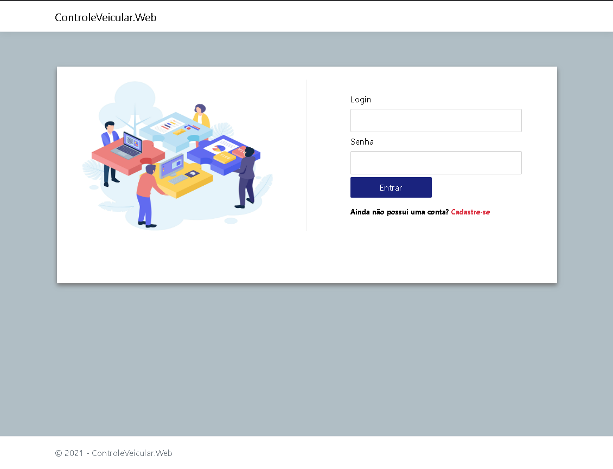
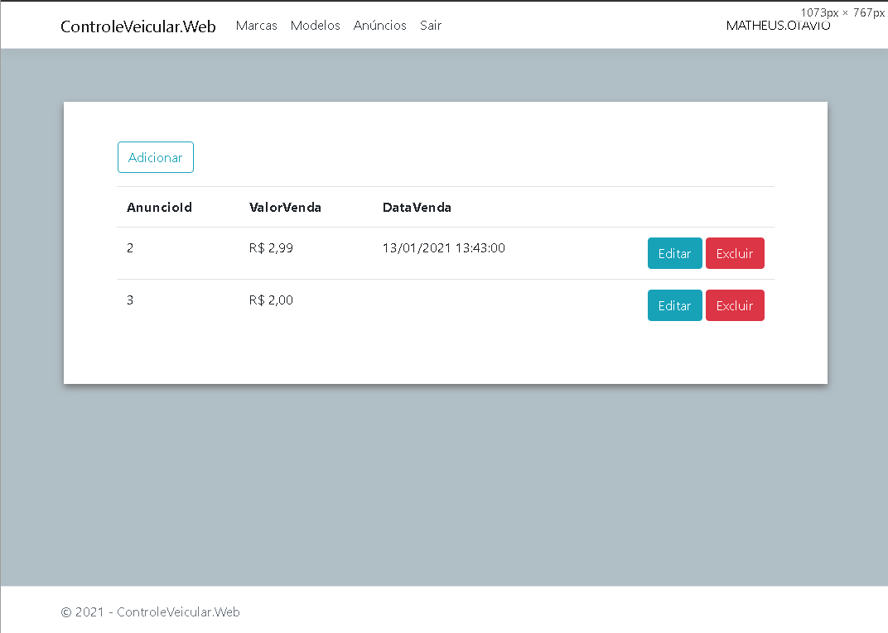
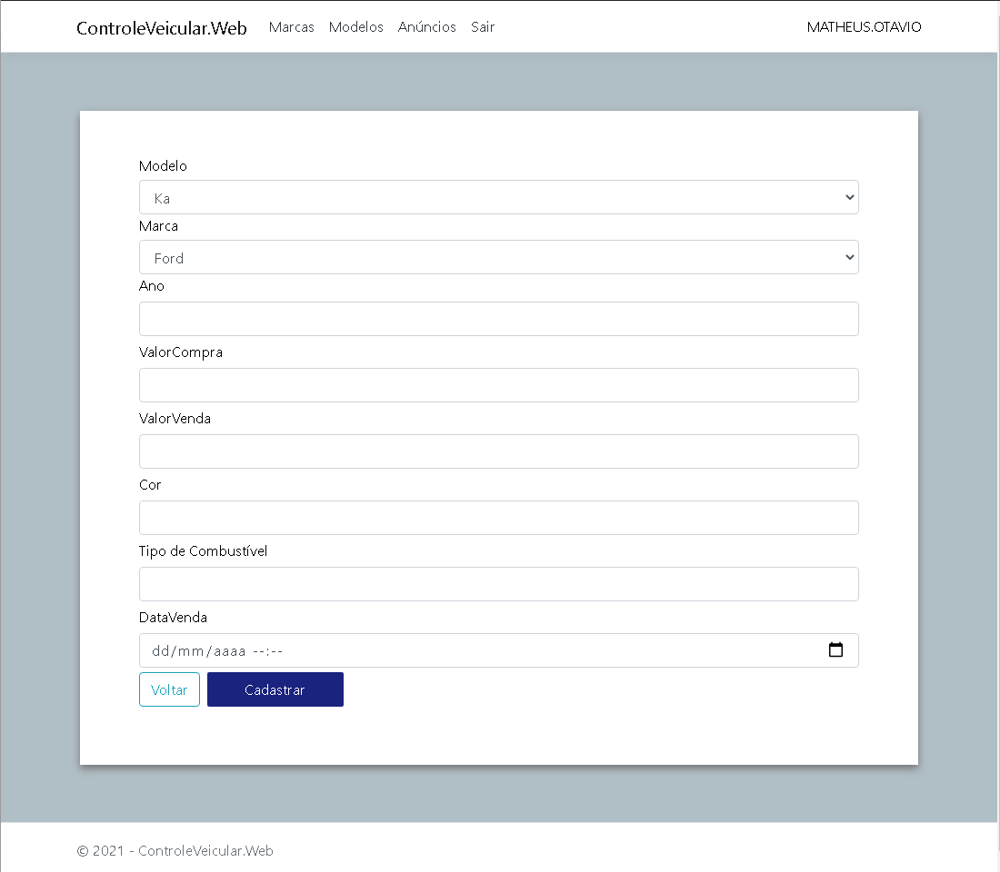
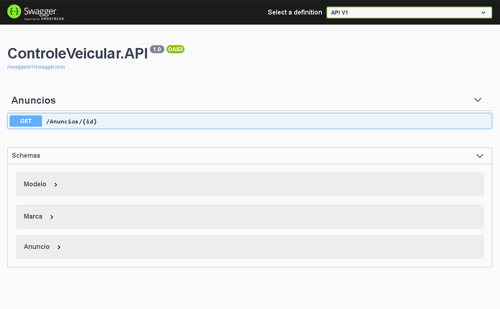

# Controle de Anúncios de Veículos





## Desenvolvimento

```sh
Configurações de banco (SQL Server) e criação das tabelas:
Abra o projeto no Visual Studio
Load Dependencies

Edite a DefaultConnection do SQLServer nos arquivos de configuração de banco presentes, definindo a sua connection string (ip, porta, banco, usuário e senha): 
	1 - Presentation
		ControleVeicular.API
			appsettings.json
		ControleVeicular.Web
			appsettings.json
	
	4.1 - ControleVeicular.Infra.Data
		appsettings.json
	
No menu Ferramentas > Gerenciador de Pacotes do Nuget  abra o Console do Gerenciador de Pacotes
Selecione como projeto padrão: 4 - Infra\4.1 - Data\ControleVeicular.Infra.Data
Execute o comando: cd ControleVeicular.Infra.Data 
Execute o comando: update-database

Para executar a aplicação Web:
	Defina como projeto de inicialização o item 1 - Presentation / ControleVeicular.Web
	Execute a aplicação
	
Para executar a Web API:
	Defina como projeto de inicialização o item 1 - Presentation / ControleVeicular.API
	Execute a aplicação
	
```

## Linguagens & Ferramentas utilizadas: 
    	C# Lambda
    	C# Linq
	.NET Core
	EF CORE
	ASP.NET Core	
	Bootstrap
	jQuery
	SweetAlert
	Swagger
	
## Abordagens utilizadas:
	DDD
	TDD
